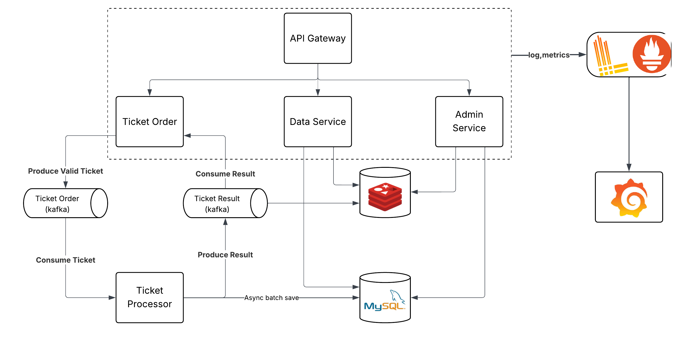

# 🎟️ Concert Ticket Booking System
Đây là project backend đặt vé cho concert sử dụng FastAPI. Hệ thống này được thiết  kế để xử lý lượng người dùng lớn cùng lúc.

---
## 🚀 Tính năng chính
- **Authentication & Authorization**: Sử dụng **Keycloak** để quản lý user, role và quyền truy cập.
- **Ticket Booking**: Người dùng có thể chọn concert, chọn zone, và đặt vé.  
- **Queue-based Load Leveling**: Kafka giúp xử lý đặt vé, tránh tình trạng quá tải và oversell.
- **Cache**: Redis được sử dụng để cache thông tin và giảm tải cho database.
- **Observability**: Giám sát bằng **Prometheus + Grafana + Loki + Tempo**, tracing với **OpenTelemetry**.  
- **Database**: MySQL

---
## 🛠️ Công nghệ sử dụng
- **Backend**: FastAPI, Python
- **Authentication**: Keycloak
- **Database**: MySQL
- **Message Broker**: Kafka
- **Cache**: Redis
- **Observability**: Prometheus, Grafana, Loki, Tempo, OpenTelemetry
- **Containerization**: Docker, Docker Compose
---

## 🏛️ Kiến trúc hệ thống

---
## Sơ đồ database

---
## 🛠️ Công nghệ sử dụng
- **Backend**: FastAPI, Python
- **Authentication**: Keycloak
- **Database**: MySQL
- **Message Broker**: Kafka
- **Cache**: Redis
- **Observability**: Prometheus, Grafana, Loki, Tempo, OpenTelemetry
- **Containerization**: Docker, Docker Compose
---
## 📦 Cài đặt và chạy hệ thống
1.  Cài đặt môi trường và thư viện:
```bash
pip install -r requirements.txt
docer-compose up -d
```
2.  Khởi tạo database:
```bash
python init_db.py
```
3.  Chạy ứng dụng:
- Chạy processor để xử lý đặt vé:
```bash
cd src/kafka
python processor.py
```
- Chạy đơn giản không cần phân quyền và chia service (recommend):
```bash
uvicorn main:app --port 8100
```
- Chạy đầy đủ với phân quyền và chia service:
```bash
cd src/service
uvicorn gateway:app --port 8000
uvicorn admin_service:app --port 8003
uvicorn data_service:app --port 8002
uvicorn ticket_ordering_service:app --port 8001
```
4.  Truy cập môi trường:
- FastAPI docs: [http://localhost:9000/docs](http://localhost:9000/docs)
- Keycloak admin: [http://localhost:8181](http://localhost:8181) (user: admin, pass: admin)
- Kafka UI: [http://localhost:8080](http://localhost:8080)
- Redis UI: [http://localhost:5540](http://localhost:5540)
- Grafana: [http://localhost:3000](http://localhost:3000) (user: admin, pass: admin)

---
## Reference
- [fastapi-observability](https://github.com/blueswen/fastapi-observability)
- Bytebytego Blog
- [viblo blog](https://viblo.asia/p/thiet-ke-he-thong-ban-ve-ticketing-system-design-GyZJZnjZJjm)
